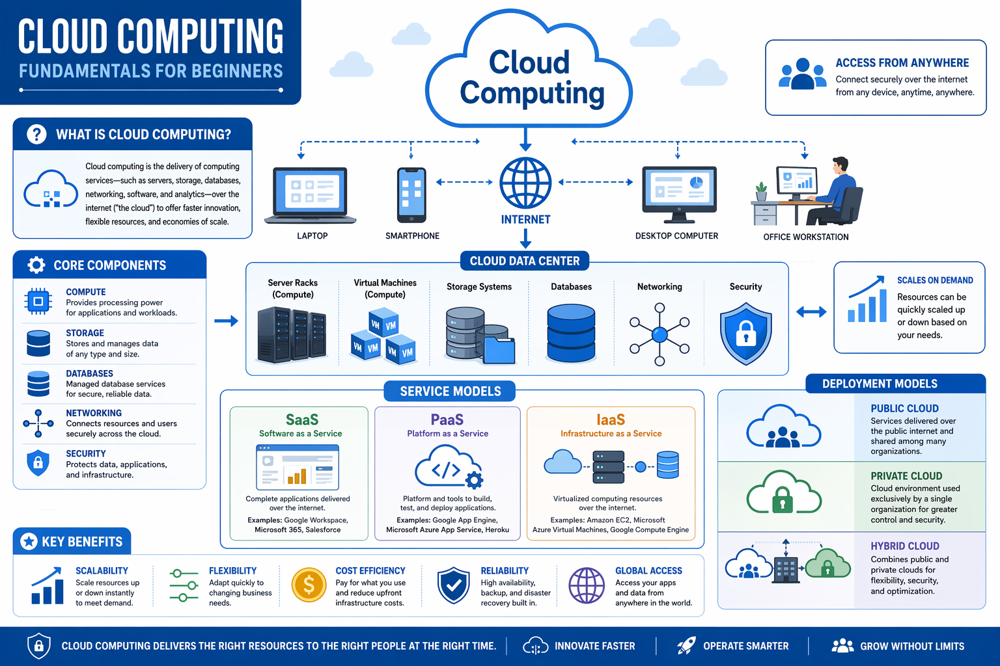

# Cloud Computing Fundamentals for Beginners

## 📊 Complete Cloud Computing Overview



---

## 🎯 What is Cloud Computing?

**Cloud computing** is the delivery of computing services—such as servers, storage, databases, networking, software, and analytics—over the internet (the "cloud") to offer faster innovation, flexible resources, and economies of scale.

### Key Characteristics:
- **On-Demand Access**: Get computing resources whenever you need them
- **Internet-Based**: Access services from anywhere with an internet connection
- **Flexible Pricing**: Pay only for what you use
- **Scalable**: Easily increase or decrease resources based on demand
- **Reliable**: Built-in redundancy and disaster recovery

---

## 🌐 Access From Anywhere

One of the primary advantages of cloud computing is **universal accessibility**:

### Devices Supported:
- **Laptops**: Full computing power for complex tasks
- **Smartphones**: Mobile access to cloud applications
- **Desktop Computers**: Traditional workstations with cloud integration
- **Office Workstations**: Enterprise-grade cloud access

### Benefits:
✅ Connect securely over the internet from any device
✅ Access your applications and data anytime, anywhere
✅ Work remotely without infrastructure limitations
✅ Collaborate with teams across different locations
✅ Maintain security while accessing from multiple devices

---

## ⚙️ Core Components of Cloud Computing

### 1. **COMPUTE**
**Purpose**: Provides processing power for applications and workloads

- **Virtual Machines**: Emulated computer systems running on physical servers
- **Containers**: Lightweight, portable application packages
- **Serverless Computing**: Run code without managing infrastructure
- **Batch Processing**: Process large volumes of data efficiently

**Examples**: AWS EC2, Microsoft Azure VMs, Google Compute Engine

---

### 2. **STORAGE**
**Purpose**: Stores and manages data of any type and size

- **Object Storage**: Store unstructured data (files, images, videos)
- **Block Storage**: High-performance storage for databases
- **File Storage**: Shared file systems for collaborative work
- **Archive Storage**: Long-term, cost-effective data retention

**Examples**: AWS S3, Azure Blob Storage, Google Cloud Storage

---

### 3. **DATABASES**
**Purpose**: Managed database services for secure, reliable data

- **Relational Databases**: Structured data with SQL (MySQL, PostgreSQL)
- **NoSQL Databases**: Flexible, scalable data (MongoDB, DynamoDB)
- **Data Warehouses**: Large-scale analytics and reporting
- **Backup & Recovery**: Automated data protection

**Examples**: Azure SQL Database, Amazon RDS, Google Cloud SQL

---

### 4. **NETWORKING**
**Purpose**: Connects resources and users securely across the cloud

- **Virtual Networks**: Isolated network environments
- **Load Balancers**: Distribute traffic across multiple servers
- **VPN/Firewalls**: Secure connections and network protection
- **DNS Services**: Domain name resolution and routing
- **Content Delivery**: Fast content distribution globally

**Examples**: Azure Virtual Networks, AWS VPC, Google Cloud VPC

---

### 5. **SECURITY**
**Purpose**: Protects data, applications, and infrastructure

- **Encryption**: Secure data in transit and at rest
- **Identity Management**: Control who accesses what
- **Compliance**: Meet regulatory requirements
- **Threat Detection**: Identify and respond to security threats
- **Access Control**: Role-based permissions and authentication

**Examples**: Azure Security Center, AWS IAM, Google Cloud Security

---

## 🏢 Cloud Data Center

The backbone of cloud computing infrastructure:

```
┌─────────────────────────────────────────────────────┐
│              CLOUD DATA CENTER                      │
├─────────────────────────────────────────────────────┤
│                                                     │
│  ┌──────────────┐  ┌──────────────────────────┐   │
│  │ Server Racks │  │ Virtual Machines         │   │
│  │ (Compute)    │  │ (Compute)                │   │
│  └──────────────┘  └──────────────────────────┘   │
│                                                     │
│  ┌──────────────┐  ┌──────────────────────────┐   │
│  │ Storage      │  │ Databases                │   │
│  │ Systems      │  │ (Relational/NoSQL)       │   │
│  └──────────────┘  └──────────────────────────┘   │
│                                                     │
│  ┌──────────────┐  ┌──────────────────────────┐   │
│  │ Networking   │  │ Security                 │   │
│  │ Infrastructure│ │ (Encryption, Firewalls)  │   │
│  └──────────────┘  └──────────────────────────┘   │
│                                                     │
└─────────────────────────────────────────────────────┘
```

### Data Center Features:
- **Redundancy**: Multiple copies of data for reliability
- **Disaster Recovery**: Automatic failover and backup systems
- **High Availability**: 99.9%+ uptime guarantees
- **Global Distribution**: Data centers in multiple regions
- **Physical Security**: Controlled access and monitoring

---

## 📦 Service Models

Cloud services are categorized into three main models:

### 1. **SaaS - Software as a Service**
**What You Get**: Complete applications delivered over the internet

- **User Responsibility**: Just use the application
- **Provider Responsibility**: Everything else (infrastructure, platform, application)
- **Examples**:
  - Microsoft 365 (Word, Excel, Teams)
  - Google Workspace (Gmail, Docs, Sheets)
  - Salesforce CRM
  - Slack

**Best For**: End users who need applications without IT management

---

### 2. **PaaS - Platform as a Service**
**What You Get**: Platform and tools to build, test, and deploy applications

- **User Responsibility**: Develop and manage applications
- **Provider Responsibility**: Infrastructure and platform
- **Examples**:
  - Microsoft Azure App Service
  - Google App Engine
  - Heroku
  - AWS Elastic Beanstalk

**Best For**: Developers who want to focus on code, not infrastructure

---

### 3. **IaaS - Infrastructure as a Service**
**What You Get**: Virtualized computing resources over the internet

- **User Responsibility**: Manage OS, applications, data
- **Provider Responsibility**: Infrastructure only
- **Examples**:
  - Microsoft Azure Virtual Machines
  - Amazon EC2
  - Google Compute Engine
  - DigitalOcean

**Best For**: Organizations needing maximum control and flexibility

---

## 📊 Service Models Comparison

| Aspect | SaaS | PaaS | IaaS |
|--------|------|------|------|
| **What You Manage** | Nothing | Applications & Data | OS, Apps, Data |
| **What Provider Manages** | Everything | Infrastructure & Platform | Only Infrastructure |
| **Complexity** | Low | Medium | High |
| **Flexibility** | Low | Medium | High |
| **Cost** | Predictable | Variable | Variable |
| **Examples** | Office 365 | Azure App Service | Azure VMs |

---

## ☁️ Deployment Models

### 1. **PUBLIC CLOUD**
**Services delivered over the public internet and shared among many organizations**

- **Advantages**:
  - Cost-effective (pay-as-you-go)
  - Highly scalable
  - No infrastructure management
  - Global accessibility

- **Disadvantages**:
  - Less control over security
  - Data privacy concerns
  - Potential performance variability

- **Best For**: Startups, small businesses, non-sensitive workloads

---

### 2. **PRIVATE CLOUD**
**Cloud environment used exclusively by a single organization**

- **Advantages**:
  - Maximum control and security
  - Customizable to specific needs
  - Compliance with regulations
  - Dedicated resources

- **Disadvantages**:
  - High initial investment
  - Requires IT expertise
  - Less scalability
  - Higher operational costs

- **Best For**: Large enterprises, sensitive data, compliance-heavy industries

---

### 3. **HYBRID CLOUD**
**Combination of public and private clouds for flexibility, security, and optimization**

- **Advantages**:
  - Best of both worlds (flexibility + security)
  - Cost optimization
  - Scalability when needed
  - Data sovereignty options

- **Disadvantages**:
  - Complex management
  - Integration challenges
  - Requires expertise in both environments

- **Best For**: Enterprises with mixed workloads, gradual cloud migration

---

## 🎯 Key Benefits of Cloud Computing

### 1. **SCALABILITY**
```
┌─────────────────────────────────────┐
│  Scale resources up or down         │
│  instantly based on demand          │
│                                     │
│  Low Traffic  → Minimal Resources   │
│  High Traffic → Maximum Resources   │
└─────────────────────────────────────┘
```
- Automatically adjust capacity
- Handle traffic spikes
- Reduce costs during low usage
- No over-provisioning

---

### 2. **FLEXIBILITY**
```
┌─────────────────────────────────────┐
│  Adapt quickly to changing          │
│  business needs                     │
│                                     │
│  • Switch services easily           │
│  • Modify configurations            │
│  • Test new technologies            │
│  • Experiment without risk          │
└─────────────────────────────────────┘
```
- Mix and match services
- Change configurations on-the-fly
- Support multiple technologies
- Rapid deployment

---

### 3. **COST EFFICIENCY**
```
┌─────────────────────────────────────┐
│  Pay only for what you use          │
│                                     │
│  Traditional: Fixed Costs           │
│  Cloud: Variable Costs              │
│                                     │
│  Reduce infrastructure costs        │
│  Eliminate upfront capital          │
│  Lower maintenance expenses         │
└─────────────────────────────────────┘
```
- No hardware investment
- No maintenance costs
- Predictable monthly bills
- Reduced operational overhead

---

### 4. **RELIABILITY**
```
┌─────────────────────────────────────┐
│  High availability and              │
│  disaster recovery built-in         │
│                                     │
│  • 99.9%+ uptime SLAs              │
│  • Automatic backups                │
│  • Failover mechanisms              │
│  • Data redundancy                  │
└─────────────────────────────────────┘
```
- Redundant systems
- Automatic failover
- Data replication
- Disaster recovery plans

---

### 5. **GLOBAL ACCESS**
```
┌─────────────────────────────────────┐
│  Access applications and data       │
│  from anywhere in the world         │
│                                     │
│  • Any device                       │
│  • Any location                     │
│  • Any time                         │
│  • Secure connections               │
└─────────────────────────────────────┘
```
- Remote work enabled
- Global collaboration
- Multi-region deployment
- Local data centers

---

## 🚀 Cloud Computing Delivers

### **INNOVATE FASTER**
- Rapid deployment of new services
- Quick experimentation
- Faster time-to-market
- Continuous updates

### **OPERATE SMARTER**
- Automated management
- Reduced manual tasks
- Better resource utilization
- Improved efficiency

### **GROW WITHOUT LIMITS**
- Unlimited scalability
- No infrastructure constraints
- Support for growth
- Cost-effective expansion

---

## 📚 AZ-900 Relevance

This diagram covers fundamental concepts tested in the **AZ-900 exam**:

| Concept | Exam Weight | Key Points |
|---------|------------|-----------|
| **Cloud Concepts** | 25-30% | Definition, benefits, types |
| **Core Services** | 35-40% | Compute, Storage, Networking |
| **Service Models** | 20-25% | SaaS, PaaS, IaaS |
| **Deployment Models** | 15-20% | Public, Private, Hybrid |

---

## 💡 Key Takeaways

1. **Cloud computing** provides on-demand access to computing resources over the internet
2. **Five core components**: Compute, Storage, Databases, Networking, Security
3. **Three service models**: SaaS (applications), PaaS (platform), IaaS (infrastructure)
4. **Three deployment models**: Public (shared), Private (exclusive), Hybrid (combined)
5. **Five key benefits**: Scalability, Flexibility, Cost Efficiency, Reliability, Global Access
6. **Data centers** are the physical infrastructure behind cloud services
7. **Security** is built into every layer of cloud computing

---

## 🎓 Next Steps

- Study each core component in detail
- Understand the differences between service models
- Learn about Azure-specific implementations
- Practice with hands-on labs
- Review exam questions on cloud concepts

**Learn more at [Cloud360 Training](https://cloud360.co)**

---

*This diagram and explanation are essential for understanding the AZ-900 exam's cloud fundamentals section.*
